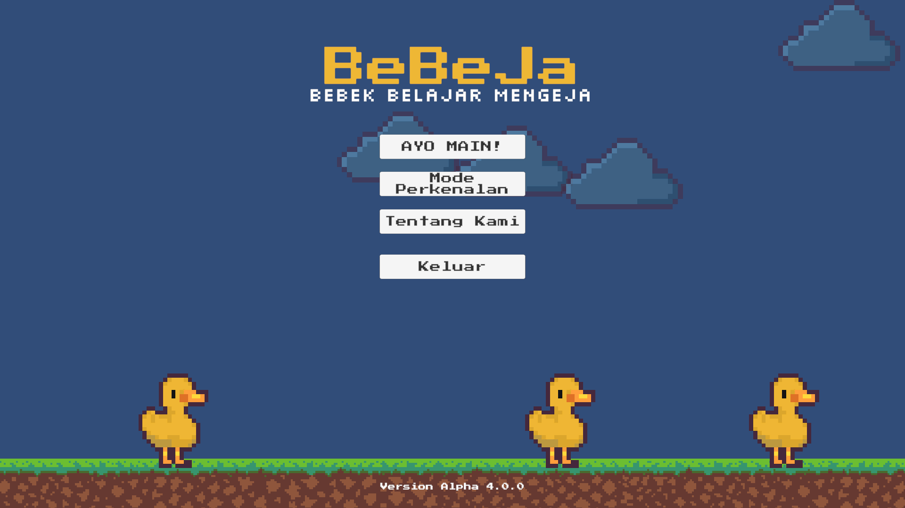
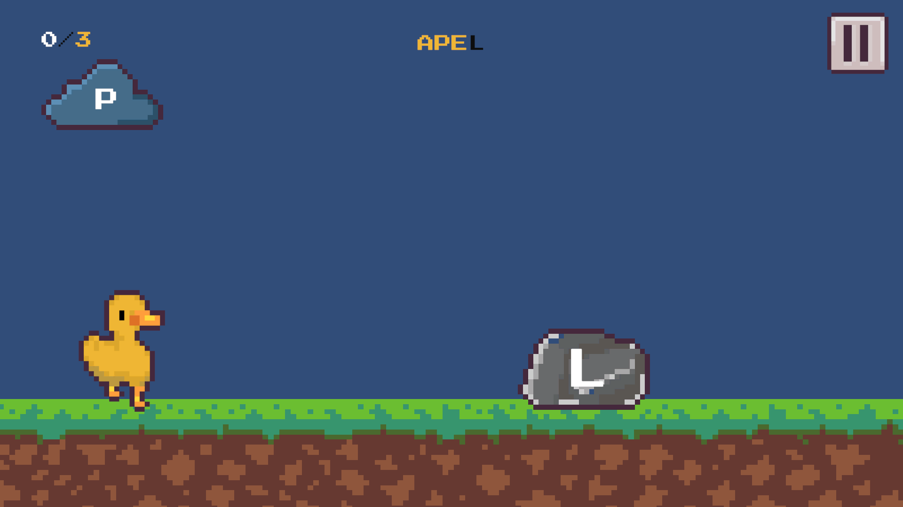

# 🦆 BeBeJa - Bebek Belajar Mengeja
### Educational Game for Children with Dyslexia

## 📌 Description  
BeBeJa (Bebek Belajar Mengeja) is an educational game designed to support children with dyslexia in improving their spelling and phonetic skills through interactive and multisensory learning.

## 🎯 Objectives  
- Support literacy development for children with dyslexia  
- Provide engaging, interactive spelling exercises  
- Enhance learning through audio-visual elements  

## ✨ Features  
- Interactive spelling gameplay  
- Phonetic-based learning approach  
- Audio-assisted pronunciation support  
- Child-friendly interface  

## 🛠️ Tech Stack  
- **Game Engine:** Unity  
- **Programming Language:** C#  
- **Audio Tools:** GarageBand  

## 👩‍💻 My Contributions  
- Produced and edited audio assets using **GarageBand**  
- Assisted in integrating audio into the game  
- Contributed to project proposal and planning  

## 🤝 Team  
This project was developed as part of the **GEMASTIK Competition (July 2024)**, representing a collaborative effort to create inclusive educational technology.

## 🚀 Getting Started  
1. Clone or download this repository  
2. Open the project using Unity Hub  
3. Run the project in the Unity Editor  

## 📚 Project Context  
Created for academic purposes, focusing on inclusive and accessible learning tools.
